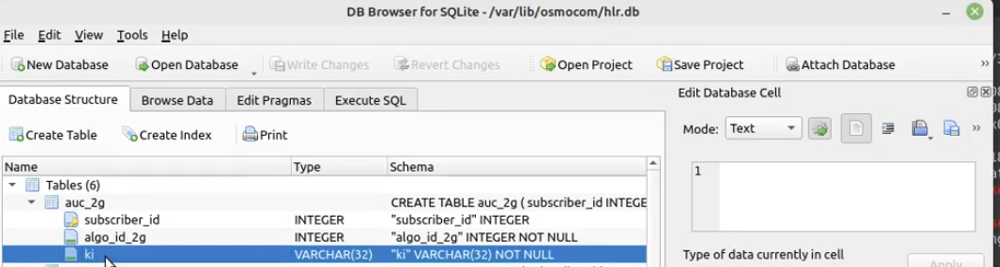

# FreeRADIUS EAP-SIM OsmoHLR/GSUP client

This package can be used to authenticate a wired (802.1x) or wireless (WPA-Enterprise) network against a SIM card using EAP-SIM.  
The required authentication data will be provided by [OsmoHLR](https://osmocom.org/projects/osmo-hlr/wiki/OsmoHLR) via the [Generic Subscriber Update Protocol (GSUP)](https://osmocom.org/projects/cellular-infrastructure/wiki/GSUP).

## Build and Install python >= 3.9 Wheel
```bash
pip install build
python3 -m build
python3 -m pip install .

# if restricted user use sudo
sudo -h python3.9 -m pip install .
```

## create directory structure for the hlr.db file
```bash
mkdir -p /var/lib/osmocom/
chmod 755 /var/lib/osmocom
touch /var/lib/osmocom/hlr.db
chmod 644 /var/lib/osmocom/hlr.db
```
## Project status
Works™, tested against OsmoHLR with [MILENAGE](https://github.com/mmehra/milenage)


## Configuration
Install module first.

In `sites-enabled/default` add `gsup` in the authorize section just above eap { ok=return } like:
```
	gsup

	eap {
		ok = return
	}
```

Create `mods-available/gsup` with:
```
python3 gsup {
	module = freeradius_osmohlr_gsup.freeradius_gsup

	mod_instantiate = ${.module}
	func_instantiate = instantiate

	mod_authorize = ${.module}
	func_authorize = authorize

	config {
		gsup_hostname = "localhost"
		gsup_port = 4222
		gsup_timeout = 5
	}
}
```
then link it to mods-enabled  -
```bash
cd /etc/freeradius/3.0/mods-enabled
ln -s ../mods-available/gsup ./
```


(configure GSUP parameters accordingly)
## Notes / Stringent requirements for Successful WiFi EAP Sim Authentication
- Sim cards have an authentication key that is secret and only buying a simcard from a manufacturer will provide you the manifest file that holds the authentication key.
- Aside from knowing the imsi number this is not enough for a successful authentication you are still required to have the "ki" secret that is used for encrypting data to and from the radius server thus this ki string must also be saved on the radius server - which in our case is the hlr.db entry under auc_2g->ki
- #############      Error message encountered when this ki value is not valid is "eap_sim: Error: Failed decoding EAP-SIM packet: Uknown mandatory attribute 22, failing"

- Authentication Key - ki - must be valid and identical to the value embedded in the sim card

## Notes / Known issues
- EAP-AKA/AKA'? Provisions for AKA are present, not tested yet.
- Credential caching loops over all cached credentials (60s timeout), possible memory/performance bottleneck

## Thanks to
- LaF0rge for implementing the GSUP de/encoder in the osmocom python package
- Darell Tan / [geekman/simtriplets](https://github.com/geekman/simtriplets) for inspiration about FreeRADIUS python module handling
- bonzi for nerd-sniping me into this adventure
